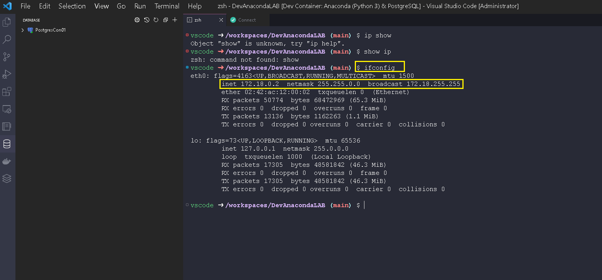
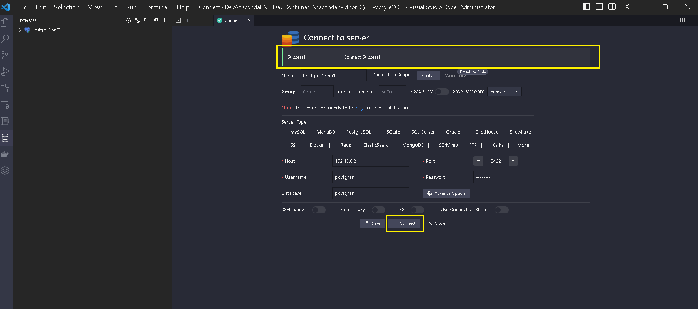

# PostgreSQL

### Question:

How to Connect to the Database in the Container after the Creation of Dev Container finished successfully?

<figure><figcaption>
Create Connection to PostgreSQL Database
</figcaption></figure>

Use `ifconfig` from the terminal on Docker container of the Dev Container to show the Container ip address, use this in the connection screen to PostgreSQL Database

<figure><figcaption></figcaption></figure>

* Connection Name : PostgresCont01
* Server Type : PostgreSQL
* Host Ip4 : 171.18.0.2
* Password : postgres
* Username : postgres
* Databse name : postgres

<figure><figcaption>
Connect to PostgreSQL Database
</figcaption></figure>

Press on the **`+Connect`** Button , this will show if the connection succeed or not:

<figure><figcaption>
Connection with PostgreSQL Succeed from VS Code
</figcaption></figure>

